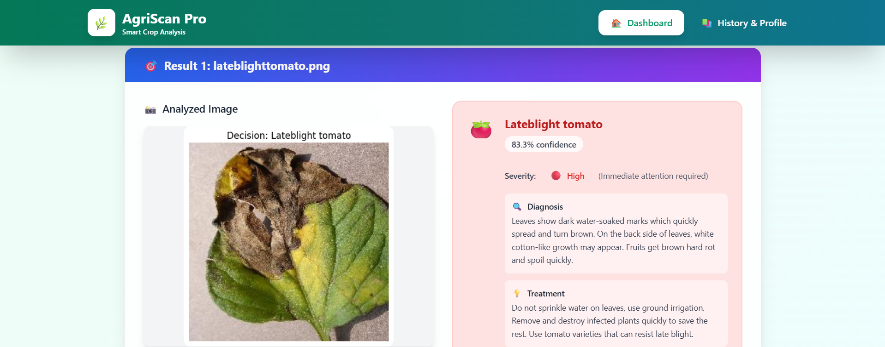
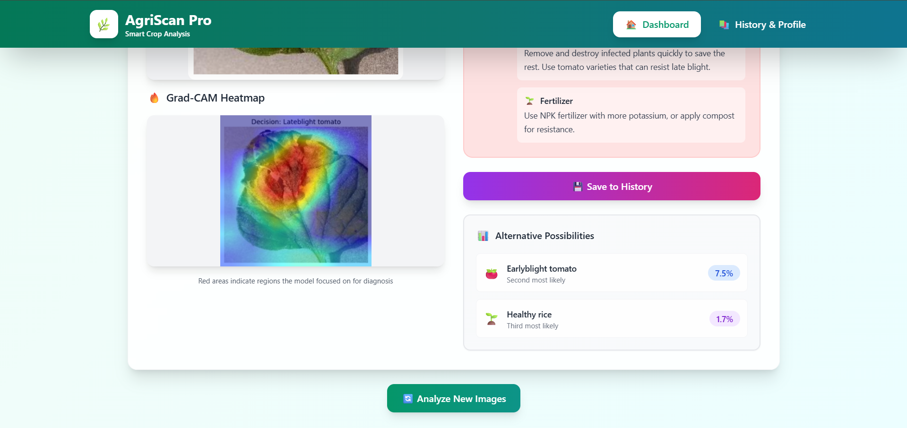

# AgriScan Pro

Agriscan Pro is a React + Vite application that allows users to upload images of crops and detect potential diseases. The app currently supports three types of crops: **rice, tomato, and corn**. For each crop, it can identify the most common diseases:

- **Rice:** Bacterial Blight, Brown Spot, Leaf Blast  
- **Tomato:** Early Blight, Late Blight, Yellow Leaf Curl Virus  
- **Corn:** Leaf Blight, Gray Spot, Common Rust  

## Key Features

- **Disease Prediction:** Upload an image and get the predicted disease with a **confidence score** indicating the severity.  
- **Detailed Insights:** For the top predicted disease, the app provides:
  - Reason for the disease
  - Fertilizer recommendations
  - Tips for prevention
- **Alternate Predictions:** Since the model can predict multiple possibilities, the top 3 predicted diseases are shown. For the 2nd and 3rd predictions, only the disease name and confidence score are displayed.  
- **Grad-CAM Visualization:** See how the model focuses on specific parts of the image to make its predictions.  
- **History Tracking:** View the details of previously uploaded images and their predictions.  

## Example

Below is a sample scenario where a user uploads a **tomato crop affected by Late Blight**. The application shows the predicted disease, confidence scores, and additional insights.

  
*Uploading a tomato image to detect Late Blight.*

  
*Results given by AgriScan Pro showing the top disease, confidence score, and insights.*

## Tech Stack

- **Frontend:** React + Vite  
- **Machine Learning:** Custom disease prediction model  
- **UI/UX:** Interactive image upload, results visualization, and history tracking  
