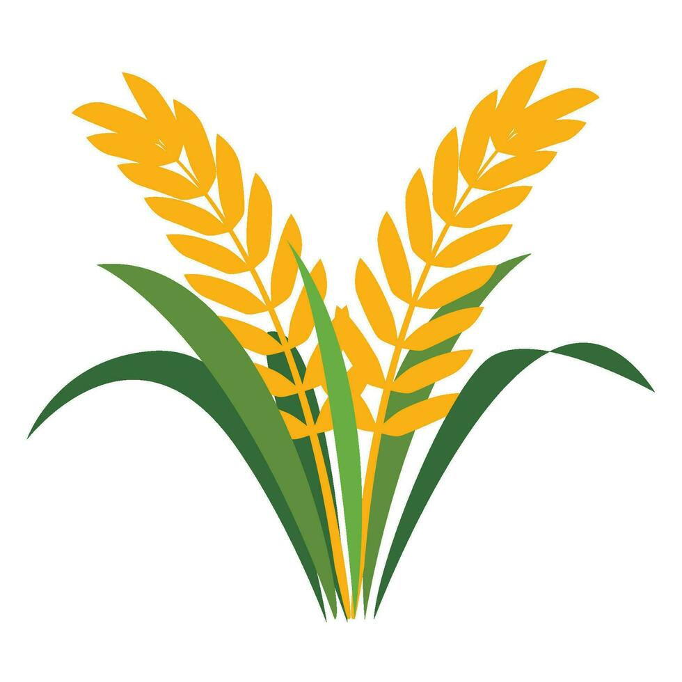
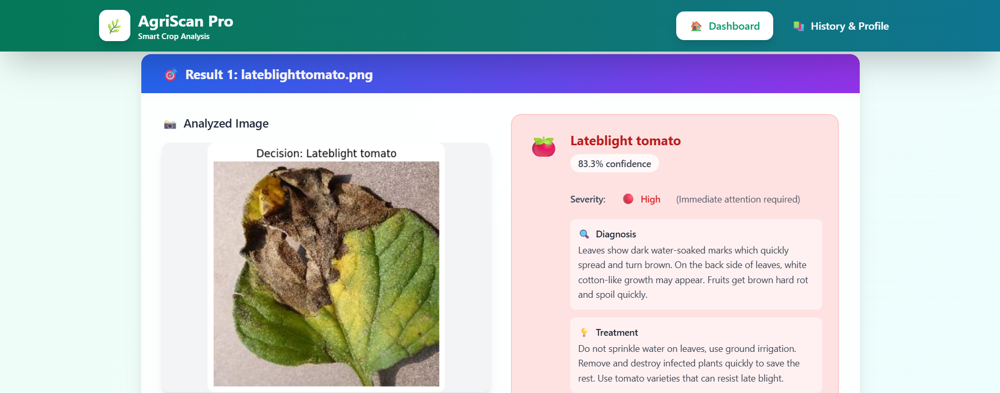
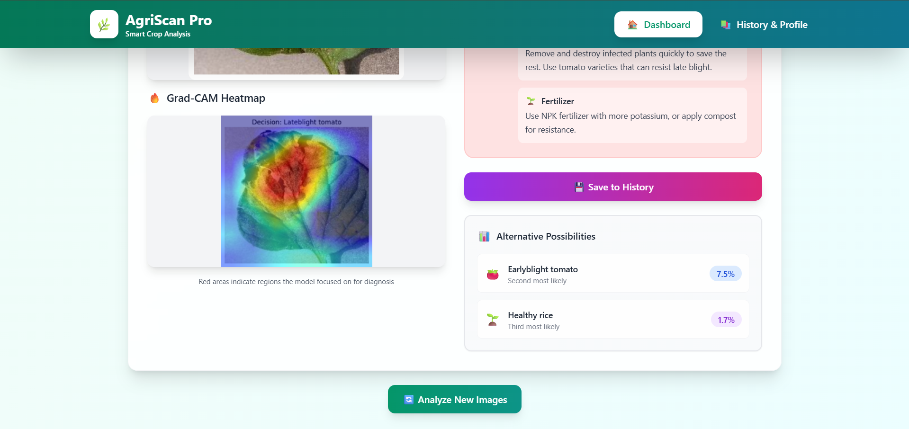
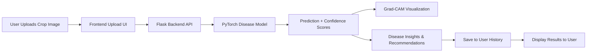
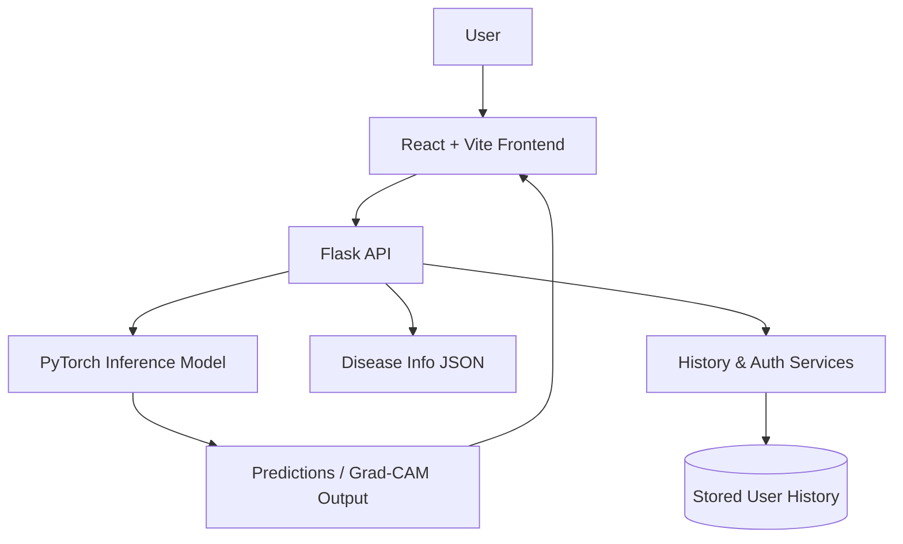

# 🌾 AgriScan Pro

<p align="center">
  
</p>

<p align="center">
  
  
  
  
</p>

AgriScan Pro is an intelligent crop disease detection platform that helps farmers and agricultural enthusiasts identify plant diseases from leaf images using deep learning. The system supports major crops such as rice, tomato, and corn, and provides disease insights, confidence scores, treatment suggestions, and history tracking in a clean and modern web experience.

## ✨ Why this project matters

Early disease detection can save crops, reduce losses, and help farmers take timely action. AgriScan Pro brings AI-powered diagnosis to a simple web app so users can upload a crop image and receive instant predictions with actionable guidance.

## 🚀 Key Features

- 🧠 AI-based disease prediction for crop leaf images
- 📊 Top-3 predictions with confidence scores
- 🔍 Grad-CAM visualization to highlight the important regions of the image
- 🌱 Disease-specific guidance including reasons, prevention tips, and fertilizer suggestions
- 🕘 User history tracking for previously analyzed images
- 🔐 Authentication and secure user-based history storage
- 📸 Support for single-image and batch-image upload

## 🧪 Supported Crops and Diseases

- Rice: Bacterial Blight, Brown Spot, Leaf Blast
- Tomato: Early Blight, Late Blight, Yellow Leaf Curl Virus
- Corn: Leaf Blight, Gray Spot, Common Rust

## 📸 Screenshots

Below is a sample workflow where a user uploads a tomato crop image for disease analysis.





## 🔄 Flow Diagram


```mermaid
flowchart LR
    A[User Uploads Crop Image] --> B[Frontend Upload UI]
    B --> C[Flask Backend API]
    C --> D[PyTorch Disease Model]
    D --> E[Prediction + Confidence Scores]
    E --> F[Grad-CAM Visualization]
    E --> G[Disease Insights & Recommendations]
    G --> H[Save to User History]
    H --> I[Display Results to User]
```

## 🏗️ Architecture Diagram


```mermaid
flowchart TD
    U[User] --> F[React + Vite Frontend]
    F --> A[Flask API]
    A --> M[PyTorch Inference Model]
    A --> D[Disease Info JSON]
    A --> H[History & Auth Services]
    H --> DB[(Stored User History)]
    M --> R[Predictions / Grad-CAM Output]
    R --> F
```

## 🛠️ Tech Stack

### Frontend
- React
- Vite
- React Router
- CSS / custom UI components

### Backend
- Flask
- Flask CORS
- JWT Authentication
- Werkzeug file handling

### AI / ML
- PyTorch-based inference model
- Grad-CAM support for visualization

## 📁 Project Structure

```text
crop_disease/
├── src/
│   ├── assets/
│   ├── backend/
│   │   ├── app.py
│   │   ├── auth.py
│   │   ├── history.py
│   │   ├── data/
│   │   └── model/
│   └── frontend/
│       ├── components/
│       └── pages/
├── package.json
├── vite.config.js
└── README.md
```

## ▶️ Getting Started

### 1) Install frontend dependencies

```bash
npm install
```

### 2) Install backend dependencies

```bash
cd src/backend
pip install -r requirements.txt
```

### 3) Run the frontend

```bash
npm run dev
```

### 4) Run the backend

```bash
cd src/backend
python app.py
```

The frontend will typically run on port 5173 and the Flask API on port 5000.

## 🔗 API Highlights

- POST /predict - Upload an image and receive disease predictions
- GET /health - Check backend health
- POST /auth/login - Login user
- POST /auth/signup - Create new account
- POST /history/save - Save prediction result to history

## 🌟 Future Improvements

- Add more crop types and disease classes
- Improve model accuracy with larger datasets
- Add multilingual support for farmers
- Introduce mobile-friendly offline support
- Deploy the app to cloud hosting for wider access

## 🙌 Acknowledgments

This project combines modern web development and machine learning to make crop disease detection more accessible, practical, and useful for real-world agriculture.
